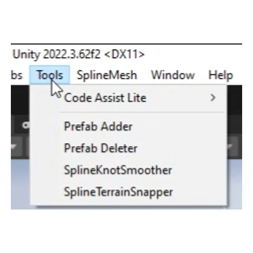
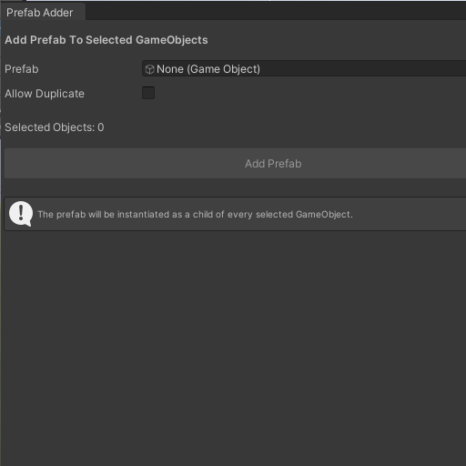
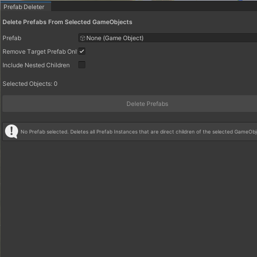

# Prefab 批处理工具

[English](README.md) | [简体中文](README_CN.md)

一个简单而实用的 Unity Editor Prefab 批处理工具集。

主要用于快速向多个选中的 GameObject 添加 Prefab，或批量删除选中对象下的 Prefab Instance，减少重复的 Hierarchy 操作。

## ✨ 功能

### Prefab Adder

批量将指定 Prefab 添加到多个选中的 GameObject 下。

- 支持同时选择多个 GameObject
- 将 Prefab 自动作为子物体添加
- 自动设置 Local Position 为 `(0, 0, 0)`
- 自动设置 Local Rotation 为 `Identity`
- 自动设置 Local Scale 为 `(1, 1, 1)`
- 支持禁止重复添加相同 Prefab
- 支持 Unity Undo

### Prefab Deleter

批量删除选中 GameObject 下的 Prefab Instance。

支持：

- 删除某种 Prefab
- 删除所有 Prefab Instance
- 仅删除直接子物体
- 递归检查 Nested Children
- 当指定 Prefab 不存在时，可选择删除其他 Prefab
- 支持 Unity Undo
- 显示删除数量

## 📸 预览

*Tools 菜单*


*Prefab Adder*


*Prefab Deleter*


## 📦 安装

将脚本放入 Unity 项目的 `Editor` 文件夹中，例如：

```text
Assets/
└── Editor/
    └── PrefabBatchTools/
        ├── PrefabAdder.cs
        └── PrefabDeleter.cs
```

无需任何额外的 Package 或依赖。

导入脚本后，工具将出现在 Unity Editor 菜单中：

```text
Tools
├── Prefab Adder
└── Prefab Deleter
```

## ↩️ Undo 支持

两个工具均支持 Unity 的 Undo 系统。

### Prefab Adder

新创建的 Prefab Instance 可通过 `Ctrl + Z` 或 **Edit > Undo** 撤销。

### Prefab Deleter

被删除的 Prefab Instance 同样可以通过 Unity 的 Undo 系统恢复。

## 🎯 使用场景

Prefab 批处理工具适用于：

- 关卡设计（Level Design）
- 环境搭建
- 场景整理
- 批量场景编辑
- 添加重复的环境元素
- 添加装饰物或交互物体
- 快速清理 Prefab Instance
- 减少重复的 Hierarchy 操作

## 📋 环境要求

- Unity 2022.3 或更高版本
- Unity Editor
- 兼容 URP
- 兼容 Built-in Render Pipeline
- 仅限 Editor 使用的工具

## ⚠️ 注意事项

- 这些工具面向 Unity Editor 工作流，应放置在 `Editor` 文件夹中。
- 工具作用于 Unity Hierarchy 中当前选中的 GameObject。
- 无需任何运行时组件。

## 📄 许可证

本项目基于 MIT 许可证开源，详见 [LICENSE](LICENSE) 文件。
